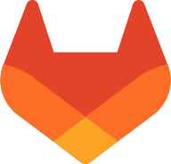

Hi 👋 My name is Kai Steinke
============================

---
> ## ❗ I do not use Github. Please check out my [Gitlab account](https://gitlab.com/kaisteinke) ❗
---

## About Me

I am currently in my last year at my apprenticeship at Siemens as a computer scientist specializing in application development.

* 🌍  I'm based in Zug, Switzerland
* 🖥️  See my portfolio at [kaisteinke.com](https://kaisteinke.com)
* ✉️  You can contact me at [kai@steinke.dev](mailto:kai@steinke.dev)
* 🤝  I'm open to collaborating on anything and everything
* ⚡  I'm fluent in English and German

### Socials

    
    

